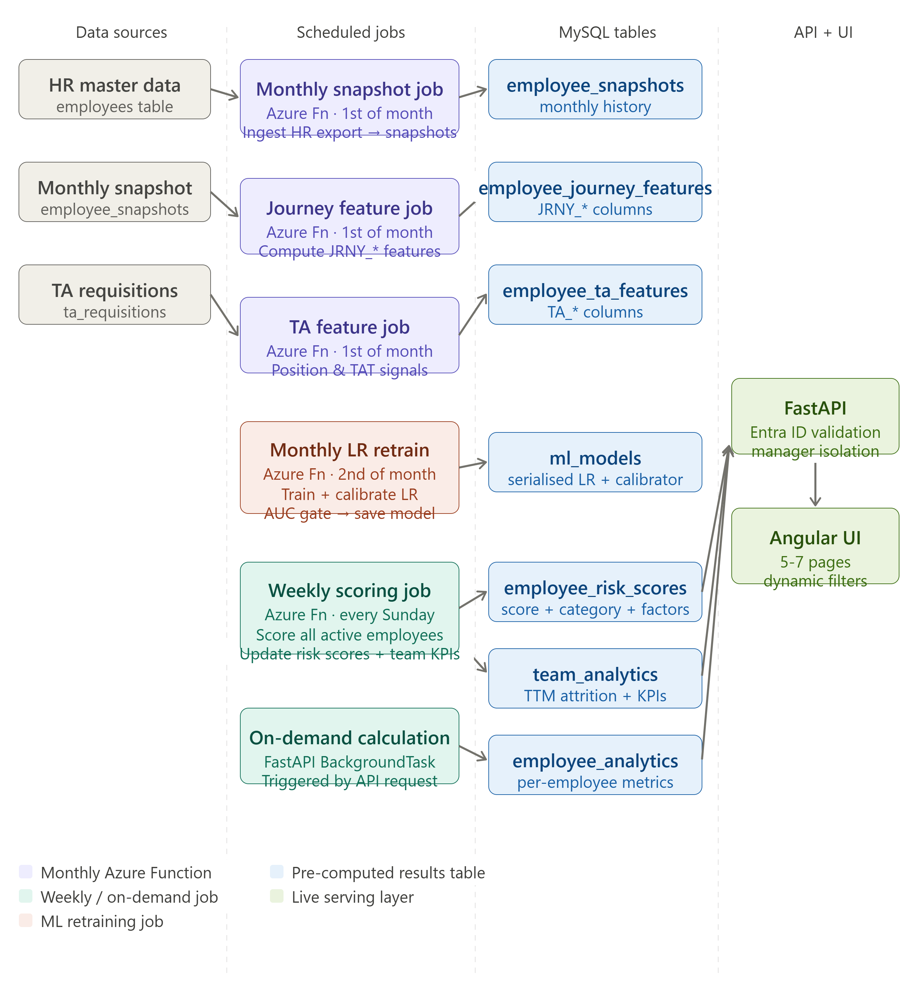

# hrautomationdashboard

## HR Analytics Backend

FastAPI backend for the HR Dashboard platform.

## Quick start

```bash
# 1. Clone and enter project
git clone <your-repo-url>
cd hr_analytics_backend

# 2. Create virtual environment
python -m venv venv

# Windows
venv\Scripts\activate

# Mac / Linux
source venv/bin/activate

# 3. Install dependencies
pip install -r requirements.txt

# 4. Copy env file and fill in your values
cp .env.example .env
# Edit .env with your MySQL credentials + Azure details

# 5. Run database migrations (creates all tables)
python scripts/run_migrations.py

# 6. (Dev only) Seed sample data from CSV
python scripts/seed_from_csv.py --file test.csv

# 7. Start the API server
uvicorn app.main:app --reload --port 8000

# API docs available at:
# http://localhost:8000/docs
```

## Project layout

The automation flow end-to-end:




```
hr_analytics_backend/
├── app/
│   ├── main.py                  # FastAPI app entry point
│   ├── core/
│   │   ├── config.py            # All settings from .env
│   │   ├── database.py          # SQLAlchemy engine + session
│   │   └── security.py          # Azure Entra ID token validation
│   ├── models/
│   │   └── tables.py            # All SQLAlchemy table definitions
│   ├── schemas/
│   │   └── responses.py         # Pydantic response models
│   ├── routers/
│   │   ├── auth.py              # POST /auth/me
│   │   ├── team.py              # GET /team/summary, /team/members
│   │   ├── employee.py          # GET /employee/{id}/analytics
│   │   ├── analytics.py         # GET /analytics/attrition, /analytics/trends
│   │   └── predictions.py       # GET /predictions/at-risk
│   ├── services/
│   │   ├── manager_service.py   # Manager → team member lookup (access control)
│   │   ├── analytics_service.py # Reads pre-computed analytics tables
│   │   └── ml_service.py        # Loads LR model, runs predictions
│   └── jobs/
│       ├── journey_features.py  # Computes JRNY_* features from snapshots
│       ├── ml_training.py       # Trains + calibrates Logistic Regression
│       ├── scoring.py           # Scores all active employees
│       └── team_analytics.py    # Computes team-level KPIs
├── scripts/
│   ├── run_migrations.py        # CREATE TABLE statements
│   └── seed_from_csv.py         # Load test.csv into employee_details
├── azure_functions/             # Azure Function timer jobs
├── tests/
└── requirements.txt
```

## Environment variables

See `.env.example` for all required variables.